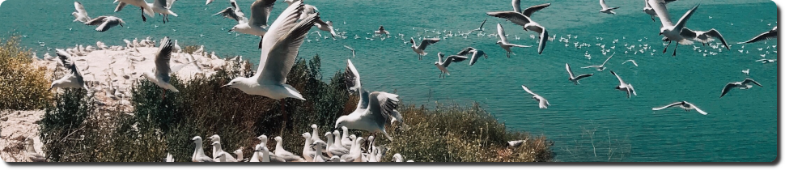

    
    
    

Hello I'm **Alex**, I write open source software.

I started studying Computer Science and Engineering at Luleå University of Technology in 2022, \
but I've been programming as a hobbyist (in one way or another) since around 2002.

